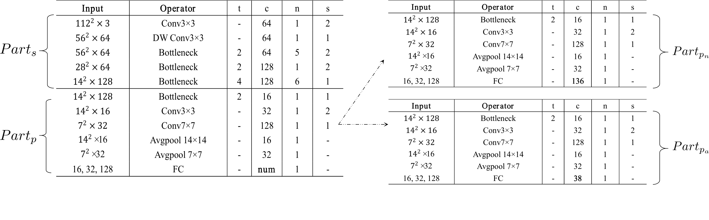

## Introduction

It is an offcial source program about [ATF](https://dl.acm.org/doi/10.1145/3394171.3414037) reference to [PFLD](https://arxiv.org/pdf/1902.10859.pdf)

And except for ATF, we also have supported AWing, Wing loss and half or quarter channel.

This programe contains 3 networks: 

1. OCN = PFLD + AVGPool - auxiliary_network
2. OCN_0.5 & OCN_0.25
3. OCNMP



If you are interested in achieve higher accuracy, you can change the backbone depth or other tricks. OCNMP is the same structure as OCN at inference, you can clip other auxiliary branches to transfer other framework.

All experiments are conducted on per RTX 1080ti.
At present, we have tested OCN and OCNMP (both with L1 loss) the accuracy on various benchmarks.

|WFLW | OCN | OCNMP |
|----|----|----|
|ION| 4.93| 4.60 |

|300W | OCN | OCNMP |
|----|----|----|
|ION| 3.87| 3.55 |

|COFW | OCN | OCNMP |
|----|----|----|
|ION| 4.18| 3.91 |

And for AFLW, we are not sure our schema of the normlizated factor is right, so we have not put here.

Also, we have tested the different performance in the WING loss and L2 loss with OCN_0.5 and OCN_0.25 on WFLW benchmark.

|network |OCN_0.5(L2) | OCN_0.5(Wing) | OCN_0.25(L2)| OCN_0.25(Wing) |
|----|----|----|----|----|
|ION| 5.60 | 4.95 | 5.91 | 5.15 |

We have not tested wing loss in OCN, ATF in OCN_0.5 and OCN_0.25. If you are intrested in implementing them, we weclome the result publiced.

## Quick start

#### Install
1. Install dependencies
````bash

pip install -r requirements.txt
````

#### Data

1. You need to download images (300W, AFLW, WFLW, COFW) from official websites and then put them into `native_dataset` folder for each dataset.

The image path in `image` folder can find the csv file, and your data directory should look like this:

````
fast_landmark_alignment_network
-- checkpoints
-- experiments
-- lib
-- logs
-- losses
-- models
-- tools
-- native_dataset
   |-- 300w
   |   |-- annotations
   |   |   |-- face_landmarks_300w_test.csv
   |   |   |-- face_landmarks_300w_train.csv
   |   |   |-- face_landmarks_300w_valid.csv
   |   |   |-- face_landmarks_300w_valid_challenge.csv
   |   |   |-- face_landmarks_300w_valid_common.csv
   |   |-- images
   |   |   |-- aflw
   |   |   |-- helen
   |   |   |-- ibug
   |   |   |-- lfpw
   |   |   |-- Test
   |-- cofw
   |   |-- annotations
   |   |   |-- face_landmarks_cofw_test.csv
   |   |   |-- face_landmarks_cofw_train.csv
   |   |-- images
   |-- wflw
   |   |-- annotations
   |   |   |-- face_landmarks_wflw_test.csv
   |   |   |-- face_landmarks_wflw_test_blur.csv
   |   |   |-- face_landmarks_wflw_test_expression.csv
   |   |   |-- face_landmarks_wflw_test_illumination.csv
   |   |   |-- face_landmarks_wflw_test_largepose.csv
   |   |   |-- face_landmarks_wflw_test_makeup.csv
   |   |   |-- face_landmarks_wflw_test_occlusion.csv
   |   |   |-- face_landmarks_wflw_train.csv
   |   |-- images
   ...

````

You can directly download the `native-dataset` by [baidu_OS](...) key:`1234`.
The repeated box csv files have more `left,right,top,bottom`, which is outputed by Retina-face network. You can choose use which one in experiments/*.json.

## Single dataset

#### Train with single dataset

````bash
python tools/train.py --data_type=WFLW --dataset_exp=15 --model_type=PFLD_AVG --lr_reduce_patience=15 --model_dir=OCN --lr=0.01 --gpus=0 --batch_size=320 --loss_type=L1 --workers=8 --image_size=112
````

#### Test 

````bash
python tools/test_filelist.py --model_type=PFLD_AVG --resume_checkpoints={`PATH`} --data_type=WFLW --gpus=0
````

## Multiple datasets

### Train with multiple datasets

````bash
python tools/train_multi.py
--main_data=WFLW 
--aux_datas=300W 
--aux_ratios=3,1 
--ratios_decay=0.92 
--dataset_exp=15
--model_type=MULTI_FLAN2
--model_dir=ATF_W331  
--lr_reduce_patience=15
--lr=0.001
--gpus=0
--batch_size=300
--loss_type=L1
--workers=8
--auxdata_aug
````

#### Test

````bash
python tools/test_filelist.py 
--model_type=MULTI_FLAN2
--resume_checkpoints=`mix/checkpoints/wflw/ATF_W331/best.pth`
--main_data=WFLW
--gpus=0
--batch_size=64
--workers=8
````


